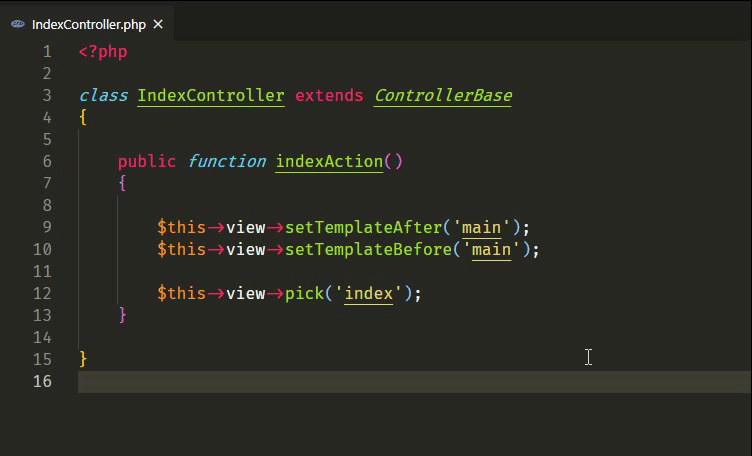

# How to use



# Settings

## quickJump

Quick jump to the first matched file switch.

```json
"phalcon-goto-view.quickJump": {
    "default": true
}
```

## maxLinesCount
Maximum number of scanning rows.

```json
"phalcon-goto-view.maxLinesCount": {
    "default": 2000
}
```

## regex

Custom regex for matching strings.

"common": Regex for matching $this->view->setTemplateAfter() function

"template": Regex for matching $this->view->pick() and $this->view->render() function

"function": Regex for matching Action function

```json
"phalcon-goto-view.regex": [
    {
        "name": "common",
        "value": "(?<=setTemplateAfter\\()(['\"])[^'\"]*\\1"
    },
    {
        "name": "template",
        "value": "(?<=pick\\(|render\\()(['\"])[^'\"]*\\1"
    },
    {
        "name": "function",
        "value": "(?<=function\\s*)([a-zA-Z_\\x7f-\\xff][a-zA-Z0-9_\\x7f-\\xff]*)"
    }
]

```

## folders

Search according to the configured path.

```json
"phalcon-goto-view.folders": {
    "default": "/app/views"
}
```

## extensions

Search views according to the configured extensions.

```json
"phalcon-goto-view.extensions": [
    ".html",
    ".volt",
    ".phtml"
]
```

